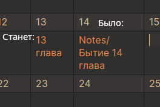

Сделал дневник чтения Библии в Obsidian.
Для начала работы скопируйте данный репозиторий к себе на компьютер и откройте в Obsidian как хранилище.
<p align="center">
  
</p>

---
## ВАЖНО!!
Если вы собираетесь использовать мой вариант ведения дневника в Obsidian, обратите внимание что тут есть папка ```.obsidian``` это значит что все мои сочетания клавиш и тема будет скопирована как удобно МНЕ. Если же вам нужно настроить под себя то удаляем эту папку, но главное установите все нужные расширения. 
Также, данный "туториал" я пишу с учётом что ты понимаешь основы Obsidian, так как это важно для работы в этой программе. Поэтому, если ты не понимаешь что тут будет говорится, то остановись на этом абзаце и иди смотри основы.
Основы по работе в этой программе и настройке её я взял [отсюда](https://youtu.be/qtld4c_18xo?si=gx_jlWno7gRQG8Nc)

---
### Что сделал собственно я сам
В файле checklist_bible содержится таблицы с чеклистом по главам книг.
Чтобы вставить туда заметку по главе в ячейку таблицы вставляем Wiklink [[]] с названием книги и номером главы (для удобства). Далее двойным кликом переходим по заметке, она создастся автоматически.
Для красивости таблицы, после создания заметки надо указать alias с нужным тебе названием заметки в properties. Либо возьми мой шаблон в папке templates, главное настрой папку для шаблонов в настройках хранилища. Чтобы применить его
```Command palette > Templates > Insert template > Выбираем шаблон Note```
и в поле aliases пишем нужное вам название.
<p align="center">
  
</p>

### Сама заметка
Для удобства ведения дневника я предлагаю установить расширение [YouVersion Linker](obsidian://show-plugin?id=youversion-linker), которое позволяет вставлять красивые ссылки и цитаты стихов Библии в различных переводах, что доступны в приложении от YouVersion.
#### Ссылка
Для того чтобы вставить только ссылку на книгу ([ин 1:2-3](https://www.bible.com/bible/400/JHN.1.2-3)) пишем ```@``` и пишем название книги в привычном для вас формате и через пробел глава:стих. Можно также указать несколько стихов через ```-```. Получится примерно вот такое ```@ин 1:2-3```. Далее выберете нужный вам перевод, предварительно скачав его в настройках расширения. Плагин создаст ссылку на сайт YouVersion с вашим отрывком. Я попытался вставить все возможные варианты сокращений книг для русского языка, если расширение не опознало ваше сокращение напишите [мне](t.me/Qn0n4m3Q) в телеграмм
#### Полная цитата
>[!Bible] [ин 3:16 SYNO](https://www.bible.com/bible/400/JHN.3.16)
>Ибо так возлюбил Бог мир, что отдал Сына Своего Единородного, дабы всякий верующий в Него, не погиб, но имел жизнь вечную.

Для того чтобы сделать подобную цитату начните писать ```>``` и по тем же правилам что я написал для ссылки введите место из писания.

### Синхронизация и сохранение изменений

Метод синхронизации я взял из ролика ниже (с таймкодом) в котором подробно рассказывается о настройке чтобы не потерять свой данные и синхронизировать их между устройствами.
[<p align="center"></p>](https://www.youtube.com/watch?v=qtld4c_18xo&t=2526)
